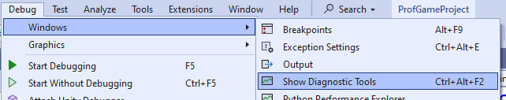
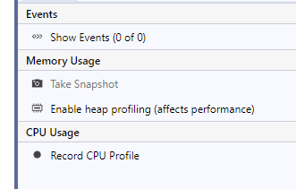
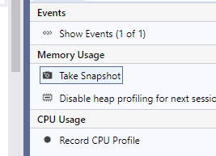
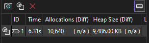

Visual Studio has a built-in tool to track memory allocations, it internally will add an entry to a list for every allocation and remove them as memory gets freed.

#### Enable the feature

Turn on the diagnostic tools window:



Turn on Heap profiling:



#### Basic usage:

Put a breakpoint as close to the end of your program execution so that as much memory as possible is freed before creating a Snapshot.

This will generally be in your winmain function.

```c++
int WINAPI WinMain(_In_ HINSTANCE hInstance, _In_opt_ HINSTANCE hPrevInstance, _In_ LPSTR lpCmdLine, _In_ int nCmdShow)
{
    {
        fw::FWWindows framework( 1280, 720 );
        Game game( framework );
        framework.Run( game );
    }

    return 0;
} // Put the breakpoint here.
```

Notice how the framework and game variables are wrapped in extra "scoping" braces, this allow them to go out of scope and have their destructors called before we hit the breakpoint.



Once the breakpoint is hit, take a "Snapshot", this will produce a clickable link with a ton of details about each allocation that hasn't been freed.



From here, you can click either the Allocations number or the Heap Size number to open a "Snapshot" window with all the detail. Double-click entries and look at the "Allocation Call Stack" to get more information about which allocations haven't been freed.
