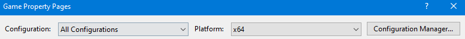
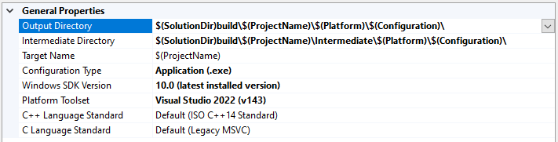
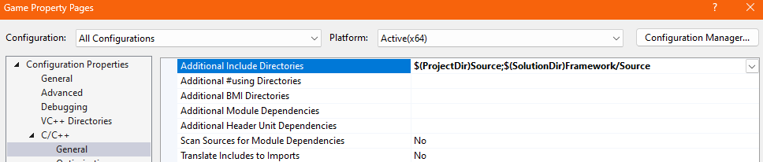
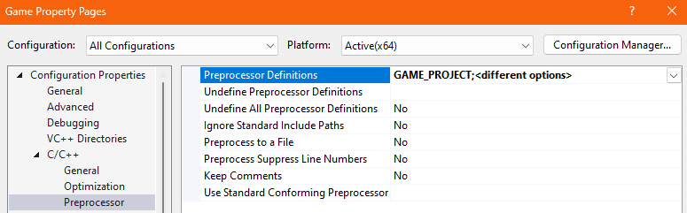
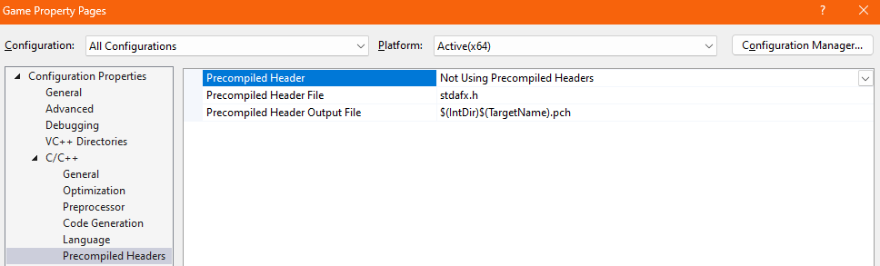
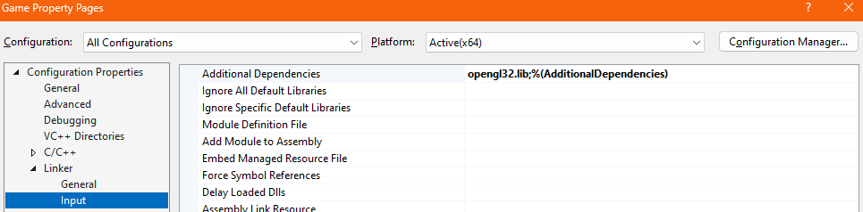
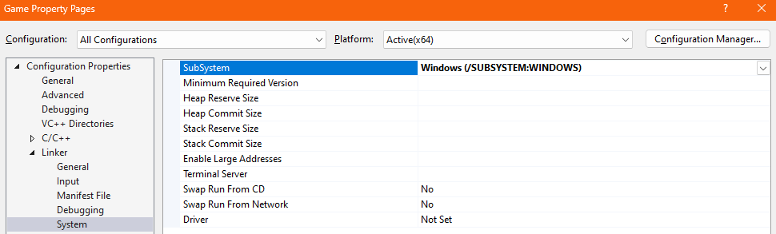
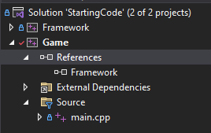
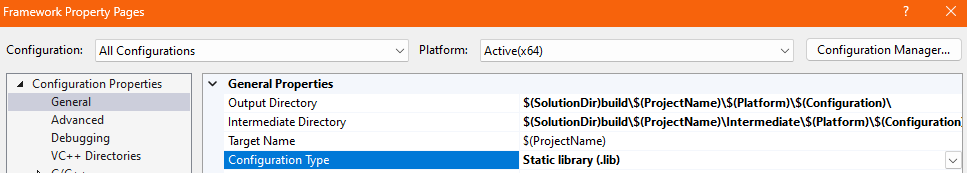

## Game Project Settings

Access by pressing `Project -> Properties`

When changing settings, you often want to make sure the top boxes are set to "All Configurations" and "All Platforms" to duplicate the new settings across all combinations.



Our projects only have a 64-bit platform, so there is no "All Platforms" option.

If a setting is specific to a single configuration, i.e. debug or release only, then you need to change these to select just one.

### General

If you don't set the location for the Output directory and the Intermediate directory, projects will by default create a bunch of folder all over your project with files scattered around. These first two settings will ensure all generated files end up in a folder called "build".



There's heavy use of macros for the Output and Intermediate Directories. This will ensure each configuration and project will place their files in separate folders and not cause conflicts.

### Advanced

**Character Set:** Use Multi-Byte Character Set

By default, projects will use Unicode characters, which adds some complexity to the way some Windows functions deal with strings for the interface.

For a bit more info, see [Unicode vs Multi-byte](../C++%20Windows%20Programming/Unicode%20vs%20Multi-byte.md)
For a lot more info, see https://web.archive.org/web/20231002163213/https://tonsky.me/blog/unicode/
which was originally at: https://tonsky.me/blog/unicode/ but appears to be dead.

### C/C++ / General

**Include Directories**:

By default when you include a file, the compiler will only look for that file:
- in the cpp file's folder
- in the project folder

You can, of course, provide subdirectories: 
```c++
#include "Renderer/Mesh.h"
```

and you can also move up folders first:
```c++
#include "../Framework/Source/Math/Vector.h"
```

but it must be relative to the cpp or the project folder. Including a header which includes other headers will also check folders relative to itself for these new headers.

This gets confusing and is easy to break.

Thankfully under this setting, we can add new folders to check:



Here, we add the Game project Source folder and the Framework project Source folder. Including a file will now check these 2 spots as well as the default ones listed above.

You'll also want to add `$(ProjectDir)Source` to your Framework project, so the framework cpp files can include other files starting with paths inside the Source folder.

This allows us to simply include files starting from the Source folders:
```
#include "Renderer/Mesh.h"
#include "Events/Event.h"
#include "Math/Vector.h"
```
without worrying about which folder we're in.

Using 3rd party libraries often requires us to add a new entry to this setting.

### C/C++ / Preprocessor

Preprocessor Definitions can be set per project and either for a all configurations simultaneously or for individual configurations.



#### C/C++ Precompiled Headers

Some of the project generated by the Visual Studio new project wizards will enable precompiled headers, this is something we'll tackle at another time, for now make sure to disable the feature:



### Linker

**Additional Dependencies:** opengl32.lib

Add any 3rd party lib files that we want to link to here.

We're using opengl, so we need to link to the correct library.

Our Framework project could also be added to this list, along with a directory entry specifying where it is, but since it's a project we build within our solution, we link it by adding a Reference (See below)


### Linker / System

If you accidentally made a Windows console application, you can change it to a Windows application here under **SubSystem**.



### References

In the solution explorer, you'll see a block for References under the each project



If you right-click it, you can add a reference, in the popup click the checkbox for the Framework project. This will allow you to link to any library project inside your solution.

## Framework Project Settings

Our framework project is a Static Library, so it needs to be set as such.



Linker settings only exist for Executable projects, since they link libraries to themselves, but all the other settings listed above apply to this project as well.
