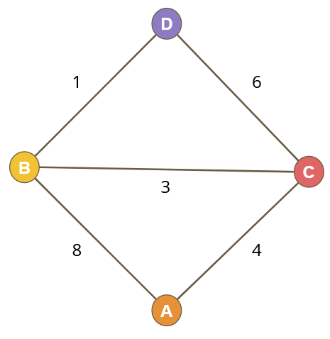
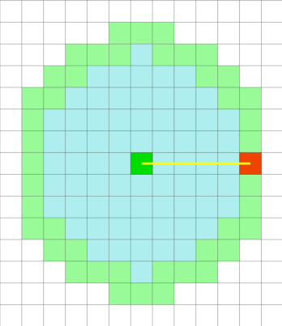
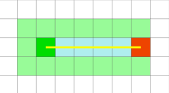
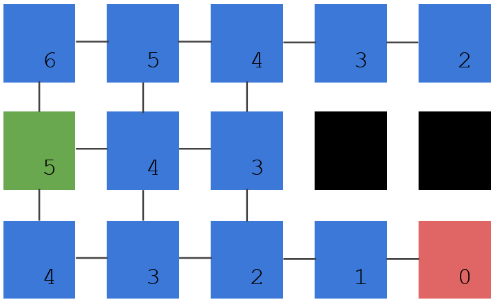

## A Simple Case

**Our goal**: find the lowest cost path from Node A to Node D
**Costs**: Traveling between nodes has a cost, each path can be different
Calculating this ourselves, the answer is:    **A -> C -> B -> D**

## Dijkstra's Algorithm

Dijkstra's algorithm is a series of steps you can follow that will find the lowest cost path through a graph of nodes. Assuming no nodes have negative costs.

#### Algorithm

We travel from the start node, giving each node some values along the way

The value we give represents the total cost of travelling to that node. We call this cost ‘G’

- Give the start node a score of 0
- Repeat the following
	- Pick the node with the lowest G
		- Stop here if this node is our target
	- Travel to all of its neighbours giving them a ‘G’ score
		- the new ‘G’ is the current node’s ‘G’ plus the cost to travel to the new node
			- if we check a node twice, we keep the lower ‘G’ score

#### Step by Step Example

[Pathfinding - Step by Step](Pathfinding%20-%20Step%20by%20Step.md)

## A* Algorithm

##### Pathfinding Visualizer
https://qiao.github.io/PathFinding.js/visual/

The A* (A Star) algorithm is a small improvement over Dijkstra's. The improvement comes from guessing about a direction and checking nodes in the "right" direction before checking nodes in the "wrong" direction.

Unlike Dijkstra's algorithm, A* doesn't guarantee finding the shortest path. It will in most cases, but if the heuristic generates estimates greater than the actual cost to travel between nodes, it may miss the shortest possible option. This won't be a problem on grids or in cases where cost is based on distance. One potentially broken case would be one where the estimate is based on distance, but certain nodes are connected via higher speed travel, like moving sidewalks.

**Dijkstra Search**

**A* Search**

#### A* Change

The main change comes from this guess at a direction, which is commonly referred to as a heuristic. This heuristic is there to help decide which node to check next. It's just an estimate and must be able to be calculated quickly.

*From wikipedia: “a heuristic, is any approach to problem solving, learning, or discovery that employs a practical method not guaranteed to be optimal or perfect, but sufficient for the immediate goals.”*

Terms:
**G**: Lowest cost found to reach a node
**H**: Estimate of the cost to get a node to the target
**F**: G+H: Used in place of G Dijkstra's algorithm to decide which node to check next

One common heuristic is the **Manhattan distance** to the target. Manhattan distance simply refers to the number of ‘blocks’ away something is ignoring obstacles

Here's an example, every node shows the estimate of how far away it is from the target. This *heuristic* must be fast to calculate, so it doesn't take into account blocked nodes

## Implementation Details

See [Exercise - Pathfinding](../../Exercises/Exercise%20-%20Pathfinding.md)

## Other Resources

Some videos that seem to explain the concepts well:

https://www.youtube.com/watch?v=EFg3u_E6eHU
https://www.youtube.com/watch?v=i0x5fj4PqP4

Any code from these and other videos might do things differently than these explanations, often with different solutions for the open and closed lists. Some are very concerned with efficiency and will use a heap or a priority queue, don't get too caught up in those details, the approach in the exercise emphasizes some more basic data manipulation, which is good practice.
