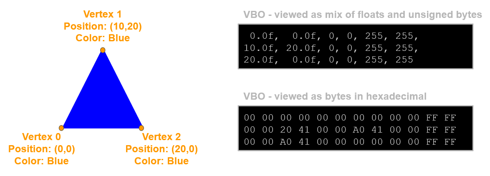
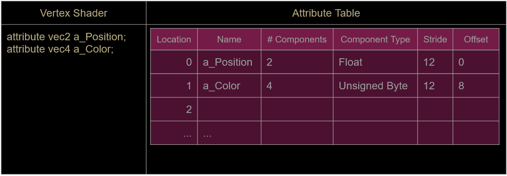

## Mixing Data Types

Rather than making an array of floats for our vertex attributes, we'll create a struct to contain more than one data type

```c++
struct VertexFormat
{
	vec2 position;
	unsigned char r, g, b, a;
};
```

We can then make an array of VertexFormats.

Keep in mind this structure is 12 bytes large:
- 4 bytes per float in the vec2
- 1 byte per unsigned char

## Functions in Structs

Structs, like classes, support functions and constructors. You can also overload constructors for easier creation of vertex lists

```c++
struct VertexFormat
{
	vec2 position;
	unsigned char r, g, b, a;

	VertexFormat(vec2 pos);
	VertexFormat(vec2 pos, unsigned char nr, ...);
}
```

A constructor like this will make it easier to initialize our array of vertices.

## Two Attributes In GLSL

Our existing shader has a single attribute for position:
	`attribute vec2 a_Position;`
We need to add an extra attribute for color:
	`attribute vec4 a_Color;`
Notice we're declaring a vec4 in the shader, which is 4 floats, but our VertexFormat structure stores color as 4 unsigned chars
We will need to normalize (put the colors in 0-1 space) when sending them to the shader (set the 4th param of glVertexAttribPointer to GL_TRUE)

## Triangle With Color



### Attribute Table

From C++, we now need to set 2 lines of the attribute table



We start by getting the location from the table with `glGetAttribLocation`

Then set the attribute properties, similar to how they were setup for the position in [Vertex Attributes and VBOs](Vertex%20Attributes%20and%20VBOs.md).

#### Things to watch out for:

- When building the VBO you need to check that you're copying the correct number of bytes of data. The VertexFormat shown above is 12 bytes large, so make sure you copy 12 bytes for every vertex in your list
- When filling the Attribute Table with glVertexAttribPointer, make sure you use the correct stride and offset values
- When calling gl_DrawArrays, double check you're drawing the correct number of vertices

